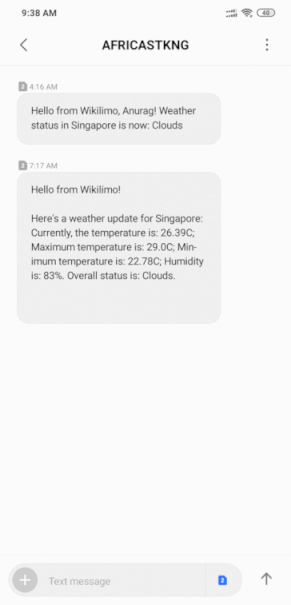
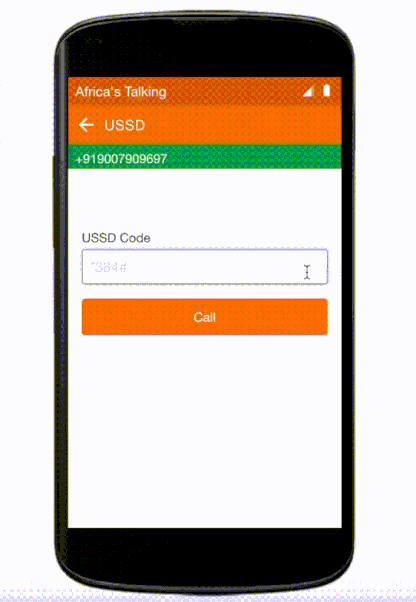

### This directory contains the source code for the Wikilimo platform's offline functionality.

## User Guide

1. All required python libraries can be installed by running `pip install -r requirements.txt`.

2. Run [this](Wikilimo_SMS.py) Python script for a demo of Wikilimo's SMS service for sending Weather Alerts:
`python Wikilimo_SMS.py <location> <recipient phone numbers>`
###### *(Eg: python Wikilimo_SMS.py Delhi +1xxxxxxxxxx +1xxxxxxxxxx ..)*

2. [This](Wikilimo_USSD.py) is the flask app built for configuring Wikilimo's USSD service for sending Weather info, weather forecasts and pest info. Our service code is ```*384*1507#```.

### Here's a demo:




Integration with the following web APIs are in progress:
 - **[Agro API v1.0](https://pyowm.readthedocs.io/en/latest/usage-examples-v2/agro-api-usage-examples.html)**, providing soil data and satellite imagery search and download
 - **[Air Pollution API v3.0](https://pyowm.readthedocs.io/en/latest/usage-examples-v2/air-pollution-api-usage-examples.html)**, providing data about CO, O3, NO2 and SO2
 - **[UV Index API v3.0](https://pyowm.readthedocs.io/en/latest/usage-examples-v2/uv-api-usage-examples.html)**, providing data about Ultraviolet exposition
 - **[Weather Alerts API v3.0](https://pyowm.readthedocs.io/en/latest/usage-examples-v2/alerts-api-usage-examples.html)**, allowing to set triggers on weather conditions and areas and poll for spawned alerts
